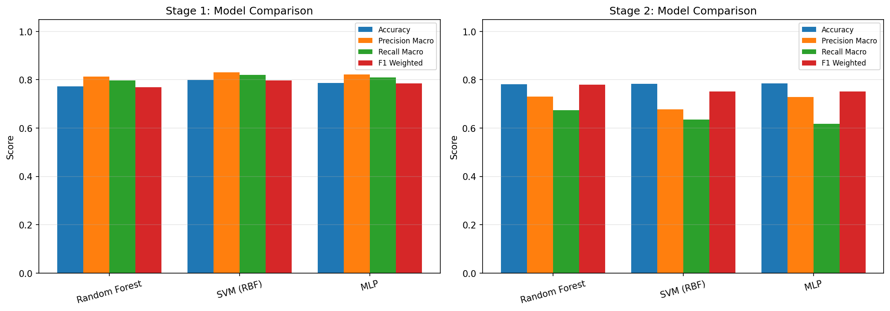
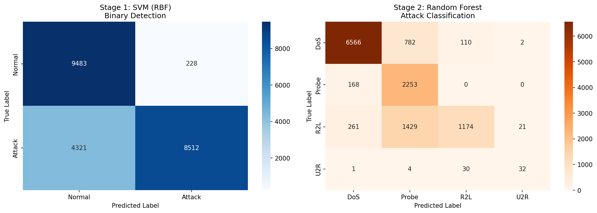
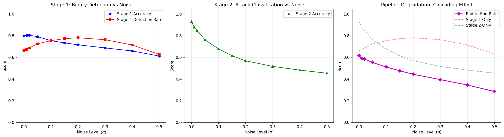
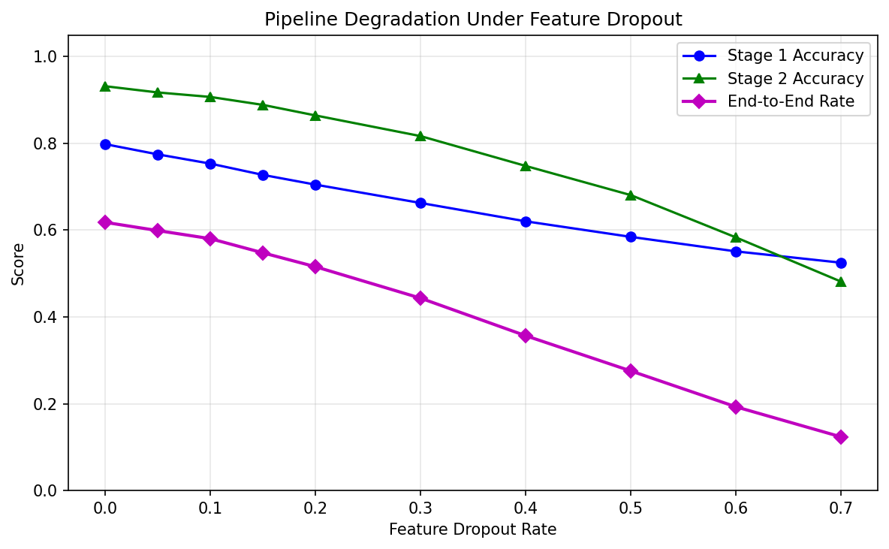
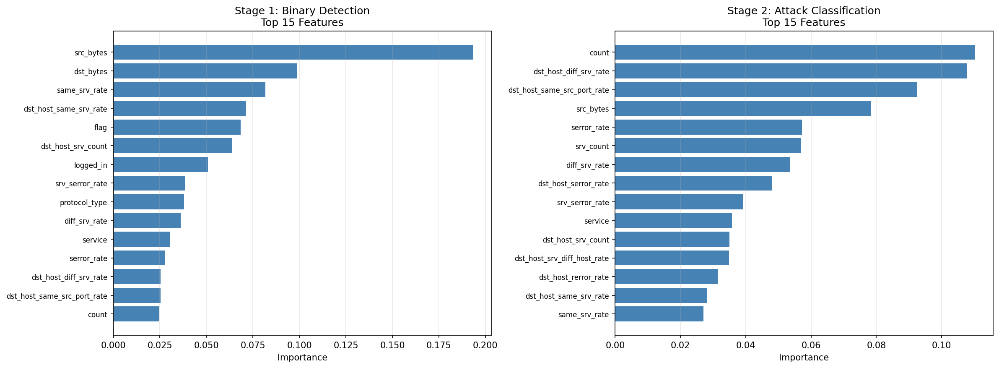

# Multi-Stage ML Pipeline for Network Intrusion Detection

Most intrusion detection research evaluates a single classifier in isolation. Train a model, report accuracy, done. But real systems aren't a single model. They're pipelines where one component feeds into the next, and when the first one screws up, everything downstream pays for it.

This project builds a two-stage detection pipeline on the [NSL-KDD](https://www.unb.ca/cic/datasets/nsl.html) dataset and then systematically breaks it to see what happens.

## What the pipeline does

**Stage 1: Binary Detection.** Is this network traffic normal, or is it an attack?

Three classifiers trained and compared: Random Forest, SVM with RBF kernel, and a Multi-Layer Perceptron. The best one is picked automatically based on weighted F1.

**Stage 2: Attack Classification.** Once something gets flagged, what kind of attack is it?

Same three model types, but trained only on attack traffic. They distinguish between four categories:

- **DoS** (neptune, smurf, back, etc.)
- **Probe** (portsweep, nmap, satan)
- **R2L** (guess_passwd, ftp_write)
- **U2R** (buffer_overflow, rootkit)

Here's the thing: Stage 2 only sees what Stage 1 sends it. If Stage 1 misses an attack, Stage 2 never gets a chance. If Stage 1 falsely flags normal traffic, Stage 2 has to deal with that noise. This is where it gets interesting.

## Robustness analysis

After training, the pipeline gets stress-tested two ways.

**Feature noise.** Gaussian noise added to input features at increasing levels (σ = 0.01 up to 0.5). Think of it as sensors being slightly off, or packet capture being lossy. The question is how fast does each stage break down, and how does that compound.

**Feature dropout.** Random features zeroed out at increasing rates (5% up to 70%). This is what happens when a log field is empty or a monitoring tool misses something. Same question: what does the end-to-end picture look like when data is incomplete.

Both experiments produce plots showing how Stage 1, Stage 2, and the full pipeline degrade as conditions worsen.

## Output

When you run it, you get:

| File | What it shows |
|------|---------------|
| `results/model_comparison.png` | All three models compared at each stage (accuracy, precision, recall, F1) |
| `results/confusion_matrices.png` | Confusion matrices for the best model at each stage |
| `results/feature_importance.png` | Top 15 features driving detection and classification (from Random Forest) |
| `results/noise_robustness.png` | Pipeline degradation curves under increasing feature noise |
| `results/dropout_robustness.png` | Same but for missing features |
| `results/summary.json` | All numbers in machine-readable format |

## Dataset

NSL-KDD. An improved version of the original KDD Cup '99 that fixes the well-known problems with duplicate records and proportional bias. Still one of the most used benchmarks for network IDS research.

About 126,000 training records and 22,500 test records. 41 features per connection (duration, protocol, bytes transferred, error rates, and so on). Three categorical features get label-encoded, everything gets min-max scaled to [0, 1]. The dataset downloads automatically on first run, about 2 MB total.

## How to run

```bash
pip install -r requirements.txt
python main.py
```

The script downloads the data, preprocesses it, trains all models for both stages, runs the full pipeline end-to-end, then runs both robustness experiments and saves everything to `results/`.

SVM with RBF kernel on 126K records takes a while. Expect 15 to 30 minutes total depending on your machine. Random Forest and MLP are fast. No GPU needed, everything runs on CPU with scikit-learn.

## Requirements

Python 3.8 or higher. numpy, pandas, scikit-learn, matplotlib, seaborn, requests. See `requirements.txt` for specific versions.

## Results

**Stage 1 (Binary Detection):** SVM with RBF kernel performed best at 79.8% accuracy and 79.7% weighted F1. False positive rate was only 2.3%, meaning almost no normal traffic gets wrongly flagged. Detection rate sits at 66.3%.

**Stage 2 (Attack Classification):** Random Forest won with 78.1% accuracy. Good at identifying DoS and Probe (large training sets), struggles more with R2L and U2R (very few samples).

**Full Pipeline:** End-to-end, 62% of attacks get both detected and correctly classified. Stage 2 in isolation is 93% accurate, but the pipeline only achieves 62% because Stage 1's misses propagate forward. That 31% gap is the cost of chaining imperfect components.

**Robustness findings:**

| Condition | Stage 1 | Stage 2 | End-to-End |
|-----------|---------|---------|------------|
| Clean data | 79.8% | 93.2% | 61.8% |
| Noise σ=0.1 | 75.5% | 67.9% | 51.2% |
| Noise σ=0.3 | 68.8% | 51.7% | 39.5% |
| Dropout 30% | 66.3% | 81.7% | 44.3% |
| Dropout 50% | 58.5% | 68.1% | 27.6% |

The main takeaway: noise is more damaging than dropout to Stage 2, but Stage 1 is the bottleneck in both cases. Small upstream degradation causes disproportionately large downstream failures.

### Plots



*Left: Stage 1 results. All three models cluster around 0.77-0.80 accuracy, with SVM slightly ahead. Precision and recall are both above 0.80 for all models. Right: Stage 2 results. Accuracy is similar across models (~0.78), but recall drops noticeably (0.62-0.67) because the rare classes (R2L, U2R) are hard to catch.*



*Left: Stage 1 (SVM). Correctly classifies 9483 normal and 8512 attack samples. The problem: 4321 attacks get misclassified as normal (missed entirely). Only 228 false positives. Right: Stage 2 (Random Forest). DoS is classified well (6566 correct), Probe is solid (2253 correct). R2L is the weak point: 1429 get confused with Probe and 261 with DoS. U2R has only 67 samples total and mostly gets labeled as other classes.*



*Three panels. Left: Stage 1 detection rate (red) actually increases from 0.66 to about 0.76 at moderate noise because noise pushes borderline samples over the decision boundary, but accuracy (blue) drops steadily. Middle: Stage 2 accuracy drops sharply from 0.93 down to about 0.45 at σ=0.5. Right: the cascading view showing that the end-to-end rate (magenta) falls well below both individual stage curves (dashed lines), demonstrating how errors compound through the pipeline.*



*Single plot with three lines. Stage 2 (green) degrades gradually from 0.93 to about 0.48 at 70% dropout. Stage 1 (blue) drops from 0.80 to about 0.52. The end-to-end rate (magenta) drops the fastest, going from 0.62 down to 0.12 at 70% dropout. All three lines diverge as dropout increases, showing the compounding effect gets worse under heavier degradation.*



*Left: Stage 1 detection is dominated by src_bytes (0.19 importance) and dst_bytes (0.09). These are the raw data volume features, which makes sense because DoS attacks transfer unusual amounts of data. Right: Stage 2 classification is led by count (0.11) and dst_host_diff_srv_rate (0.09). These are connection-pattern features that distinguish between attack strategies. The two stages rely on fundamentally different signals.*

## Project structure

```
ml-intrusion-detection-pipeline/
    main.py                 Entry point, runs everything
    requirements.txt
    README.md
    src/
        __init__.py
        data_loader.py      Downloads and preprocesses NSL-KDD
        pipeline.py         Stage 1 + Stage 2 training and evaluation
        robustness.py       Noise and dropout experiments, plotting
    data/                   Created at runtime
    results/                Created at runtime (plots + summary JSON)
```

## Things worth knowing

The NSL-KDD test set is intentionally harder than the training set. It includes attack types that don't appear during training, so test accuracy being lower than training accuracy is expected. That's by design in the dataset, not a bug.

Class imbalance is real. U2R has 52 training samples while DoS has nearly 46,000. The weighted F1 score handles this when picking the best model.

The robustness experiments use a fixed random seed but results can still vary slightly across runs because of how SVM and MLP training works internally.

## Author

Uvesh Patel
