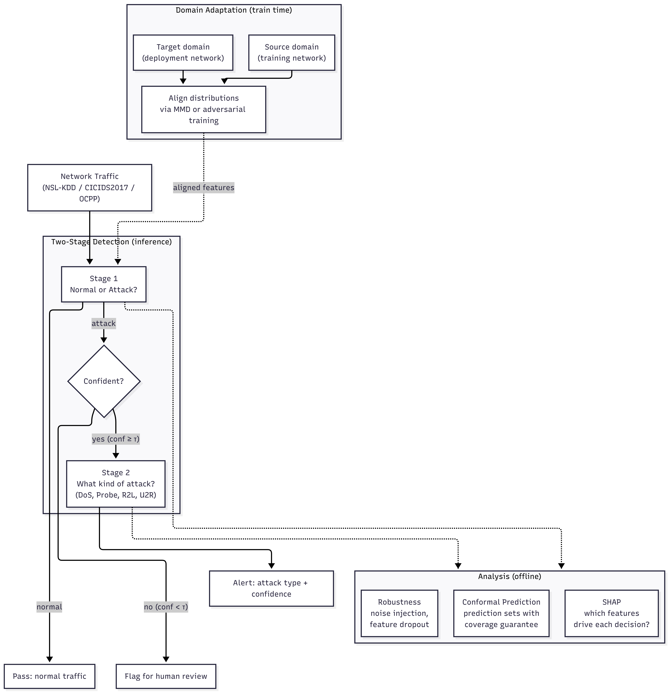
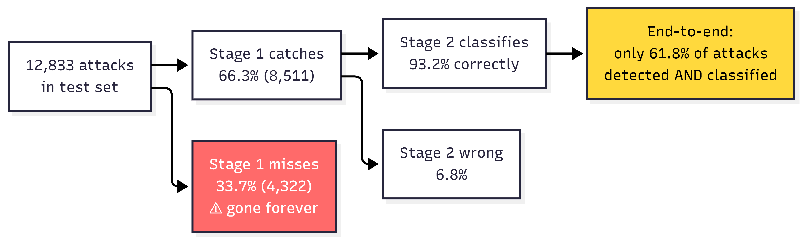
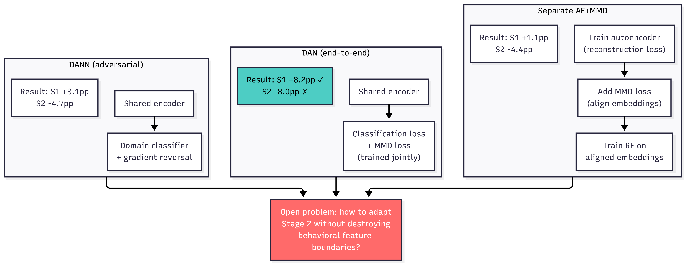

# Trustworthy Multi-Stage Intrusion Detection with Domain Adaptation

A two-stage intrusion detection pipeline that measures how cascading errors and distribution shift break real IDS systems, then tries to fix them with domain adaptation, conformal prediction, and SHAP explainability. Tested on NSL-KDD, CICIDS2017, and OCPP 1.6 WebSocket charging station traffic.

<p align="center">
  
</p>

## The Problem

Most IDS research reports single-model accuracy on a clean test split and calls it a day. In practice, detection systems are pipelines: Stage 1 decides "attack or not," Stage 2 classifies the attack type. When Stage 1 misses an attack, Stage 2 never sees it. That missed sample is gone.

On NSL-KDD, Stage 1 catches 77.3% of attacks and Stage 2 scores 93% on what it receives. But end-to-end, only 62% of attacks get both detected *and* correctly classified. That 31-point gap comes entirely from Stage 1 errors cascading forward.

<p align="center">
  
</p>

On top of that, NSL-KDD has an intentional train/test distribution shift (different attack proportions, unseen attack subtypes). Models trained in the lab degrade when tested on more realistic conditions. This project measures exactly how much, and tests what works to fix it.

## What This Project Does

### 1. Baseline Pipeline (`main.py`)

Two-stage IDS with three classifiers (Random Forest, SVM, MLP) compared at each stage. RF wins both stages. Includes robustness analysis under Gaussian noise and feature dropout to show how noise at Stage 1 drags down the whole pipeline.

| Noise Level (σ) | Stage 1 Acc | Stage 2 Acc | End-to-End |
|:---:|:---:|:---:|:---:|
| 0.0 | 77.3% | 93.2% | 62.0% |
| 0.1 | 73.0% | 68.0% | 47.0% |
| 0.5 | 55.0% | 35.0% | 28.0% |

<p align="center">
  
</p>

### 2. Domain Adaptation (`run_domain_adaptation.py`)

Three approaches to handle the train/test distribution shift:

| Method | Stage 1 Acc | Stage 2 Acc | What Happened |
|--------|:---:|:---:|---------------|
| Baseline RF (raw features) | 77.3% | 78.1% | No adaptation |
| Separate AE + MMD | 78.4% | 77.2% | Aligned embeddings, but encoder not trained for classification |
| **DAN (end-to-end)** | **85.5%** | 76.0% | Best for detection, but hurts multi-class |
| DANN (gradient reversal) | 80.4% | 77.7% | Weaker signal than direct MMD |

<p align="center">
  
</p>

The separate AE+MMD approach (Run 3 in the experiment log) reduced MMD by 95.9% but barely moved accuracy. The encoder learned domain-invariant features, but since it was trained for reconstruction, not classification, those features weren't useful for the downstream task.

DAN fixes this by jointly optimizing classification loss and MMD. The encoder learns features that are both discriminative *and* domain-invariant. Stage 1 jumped from 77.3% to 85.5%.

Stage 2 didn't improve under *any* adaptation method. SHAP analysis (below) explains why: global alignment preserves volume-based features (bytes transferred) that Stage 1 needs, but flattens the behavioral patterns (connection counts, error rates) that Stage 2 relies on. Class-conditional alignment is the open problem here.

Based on: Long et al. (2015) *Learning Transferable Features with Deep Adaptation Networks* (ICML); Ganin et al. (2016) *Domain-Adversarial Training of Neural Networks* (JMLR).

### 3. Embedding Architecture Comparison (`run_embedding_comparison.py`)

Does the encoder architecture matter, or is end-to-end training the real driver? Tested autoencoder, multi-scale 1D-CNN, and Transformer encoder, each with and without MMD alignment:

| Architecture | Accuracy | F1 | MMD | Parameters |
|-------------|:---:|:---:|:---:|:---:|
| Raw features (no embedding) | 77.3% | 77.2% | 0.0530 | 0 |
| Autoencoder | 74.9% | 74.6% | 0.0207 | 3,769 |
| 1D-CNN | 76.7% | 76.6% | 0.0409 | 12,505 |
| Transformer | 75.2% | 75.0% | 0.0075 | 29,209 |
| CNN + MMD | 76.7% | 76.5% | 0.0041 | 12,505 |
| **Transformer + MMD** | **79.4%** | **79.4%** | **0.00005** | 29,209 |

Transformer+MMD is the only embedding that beats raw features. Its self-attention captures global feature interactions, and joint MMD training nearly eliminates distribution shift (MMD drops from 0.053 to 0.00005). But note: DAN still outperforms at 85.5% because it trains the classifier end-to-end, not just the encoder.

The takeaway: architecture choice matters less than the training procedure. End-to-end adaptation (DAN) beats separate encode-then-classify across all architectures.

### 4. Confidence-Aware Pipeline (`run_confidence_analysis.py`)

The DAN model flags 5.3% of uncertain samples for human review and reaches 86.3% accuracy on the rest. Compare that to RF, which needs to flag 27.8% of samples to reach comparable accuracy.

DAN is also better calibrated: ECE = 0.14 vs RF's ECE = 0.37. When DAN says "90% confident," it's correct about 90% of the time. RF's confidence scores are less reliable.

### 5. Conformal Prediction (`run_full_evaluation.py`)

Prediction sets with formal coverage guarantees, using split conformal prediction (Vovk et al., 2005). Two calibration modes compared:

| Calibration Mode | Coverage at α=0.10 | Guarantee Met? |
|:---|:---:|:---:|
| Source-calibrated (training CV) | 77.3% | **NO** |
| Target-calibrated (test split) | 90.7% | **YES** |

Source-calibrated conformal prediction fails under shift. The calibration scores from training (mean=0.0038) are too low because the model is nearly perfect on source data. At test time, the shift causes far higher nonconformity scores, and the prediction sets become useless singletons with broken coverage.

Target-calibrated conformal works: coverage holds at 90.7% with average set size 1.20 (80.5% singletons, meaning most predictions are still decisive).

This is a quantitative argument for domain adaptation: without it, even methods with mathematical guarantees give false safety assurances.

Based on: Angelopoulos & Bates (2021) *A Gentle Introduction to Conformal Prediction* (arXiv:2107.07511).

### 6. SHAP Explainability (`run_full_evaluation.py`)

TreeSHAP on RF models reveals that the two stages rely on fundamentally different feature families:

- **Stage 1** (detection): volume features — `src_bytes` (0.104), `dst_bytes` (0.061), `dst_host_srv_count` (0.042)
- **Stage 2** (classification): behavioral features — `count` (0.034), `dst_host_serror_rate` (0.031), `dst_host_same_src_port_rate` (0.025)

<p align="center">
  
</p>

This explains the domain adaptation results: global MMD alignment preserves volume distributions (good for Stage 1) but disrupts behavioral boundaries (bad for Stage 2). R2L and U2R attacks, which lack the obvious byte-count signature of DoS, get confused. Misclassification analysis confirms: 22.7% error rate, and the top error drivers are volume features.

Based on: Lundberg & Lee (2017) *A Unified Approach to Interpreting Model Predictions* (NeurIPS).

### 7. CICIDS2017 Validation (`run_cicids_experiment.py`)

Pipeline validated on a modern dataset (2.8M flows, 78 CICFlowMeter features). Results: 99.88% binary detection, 99.98% attack classification. These near-perfect scores exist because the standard random train/test split preserves the same distribution. The contrast with NSL-KDD (77.3% under shift) shows that the shift is the real problem, not the model.

Dataset: Sharafaldin et al. (2018) *Toward Generating a New Intrusion Detection Dataset* (ICISSP).

### 8. OCPP WebSocket IDS (`run_ocpp_experiment.py`)

Cross-station domain adaptation on EV charging traffic using OCPP 1.6. The dataset has 3 clients (charging stations), so training on Client 1 and testing on Client 2 creates a natural shift.

| Scenario | Accuracy |
|:---|:---:|
| Same-station (no shift) | 99.55% |
| Cross-station Client 1 → 2 | 99.80% |
| Cross-station + DAN | 99.86% |

The shift between stations is mild (same protocol, similar traffic patterns), so DAN adds almost nothing. The interesting experiment is the cross-dataset one below.

Dataset: Dalamagkas et al. (2025) *Federated Detection of OCPP 1.6 Cyberattacks* (arXiv:2502.01569).

### 9. Cross-Dataset Transfer (`run_cross_dataset_experiment.py`)

Train on CICIDS2017 (enterprise office network, 2017), deploy on OCPP (EV charging stations, 2024). Both datasets share 56 CICFlowMeter features but come from completely different environments.

| Scenario | Accuracy | CP Coverage (α=0.10) |
|:---|:---:|:---:|
| In-domain (OCPP only) | 99.47% | — |
| Cross-dataset (no adaptation) | 20.00% | 20.0% (**violated**) |
| Cross-dataset + DAN | 22.40% | — |

Everything collapses. A model trained on enterprise traffic is useless on charging station traffic. DAN barely helps (+2.4pp). Conformal prediction coverage drops from 90% to 20%.

This is an honest negative result: simple feature alignment can't bridge fundamentally different network environments. The distribution shift here isn't a matter of proportions shifting; it's entirely different traffic behavior. More sophisticated adaptation (or environment-specific fine-tuning) is needed.

## Results at a Glance

| Metric | NSL-KDD | CICIDS2017 |
|:---|:---:|:---:|
| Stage 1 baseline RF | 77.3% | 99.88% |
| Stage 1 DAN-adapted | 85.5% | — |
| Stage 1 DAN + confidence gating | 86.3% | — |
| Stage 2 F1 (weighted) | 78.0% | 99.98% |
| CP coverage (α=0.10, target-cal) | 90.7% | 99.88% |
| End-to-end baseline | 62.0% | — |

<p align="center">
  
</p>

## Project Structure

```
cyber_defense_pipeline/
├── main.py                          Baseline pipeline (RF, SVM, MLP) + robustness
├── run_domain_adaptation.py         DAN, DANN, AE+MMD comparison
├── run_embedding_comparison.py      AE vs 1D-CNN vs Transformer embeddings
├── run_confidence_analysis.py       Uncertainty estimation + selective prediction
├── run_full_evaluation.py           Conformal prediction + SHAP on NSL-KDD
├── run_cicids_experiment.py         CICIDS2017 validation
├── run_ocpp_experiment.py           OCPP WebSocket cross-station experiment
├── run_cross_dataset_experiment.py  CICIDS2017 → OCPP cross-dataset transfer
├── download_ocpp.py                 OCPP dataset downloader (Zenodo)
├── experiment_log.md                Lab notebook — what was tried and what happened
├── literature_review.md             14 papers covering the main components
├── references.md                    Full citations with open-access links
├── requirements.txt
├── src/
│   ├── data_loader.py               NSL-KDD download + preprocessing (41 features)
│   ├── data_loader_cicids.py         CICIDS2017 download from Hugging Face
│   ├── data_loader_ocpp.py           OCPP 1.6 WebSocket data (TCP/IP + App layers)
│   ├── pipeline.py                   Two-stage training and end-to-end evaluation
│   ├── embedding.py                  Autoencoder (41→32→16→32→41)
│   ├── embedding_sequential.py       1D-CNN and Transformer embedding architectures
│   ├── domain_adaptation.py          MMD computation + AE alignment training
│   ├── dan_model.py                  DAN and DANN (end-to-end with gradient reversal)
│   ├── confidence.py                 Calibration (ECE) + selective prediction
│   ├── conformal.py                  Split conformal prediction (source + target cal)
│   ├── explainability.py             TreeSHAP attribution + misclassification analysis
│   └── robustness.py                 Noise/dropout stress testing + visualization
├── docs/images/                     Architecture diagrams
├── data/                            Auto-downloaded at runtime
└── results/                         JSON metrics + plots from each experiment
```

## How to Run

```bash
pip install -r requirements.txt

# Each script is self-contained — run whichever experiments you want
python main.py                          # Baseline + robustness (~20 min)
python run_domain_adaptation.py         # DAN/DANN comparison (~10 min)
python run_embedding_comparison.py      # Architecture comparison (~15 min)
python run_confidence_analysis.py       # Confidence gating (~5 min)
python run_full_evaluation.py           # Conformal + SHAP (~3 min)
python run_cicids_experiment.py         # CICIDS2017 (~10 min, downloads ~843 MB)
python run_ocpp_experiment.py           # OCPP WebSocket (~2 min, needs download_ocpp.py first)
python run_cross_dataset_experiment.py  # CICIDS→OCPP cross-dataset (~5 min)
```

NSL-KDD downloads automatically (5 MB). CICIDS2017 downloads from Hugging Face (~843 MB). For OCPP, run `python download_ocpp.py` first (10 MB from Zenodo, uses curl).

No GPU required. Python 3.8+.

## Datasets

| Dataset | Source | Features | Size | Access |
|:---|:---|:---:|:---:|:---|
| NSL-KDD | Tavallaee et al. (2009) | 41 | 5 MB | [GitHub](https://github.com/defcom17/NSL_KDD) |
| CICIDS2017 | Sharafaldin et al. (2018) | 78 | 843 MB | [Hugging Face](https://huggingface.co/datasets/c01dsnap/CIC-IDS2017) |
| OCPP 1.6 WebSocket | Dalamagkas et al. (2025) | 87 (TCP) / 49 (App) | 10 MB | [Zenodo](https://zenodo.org/records/14887131) |

## Open Questions

- **Class-conditional domain alignment:** align Stage 2 per-class instead of globally, to preserve behavioral feature boundaries
- **End-to-end conformal guarantees:** how to compose conformal sets across multi-stage pipelines
- **Cross-environment transfer:** the CICIDS→OCPP experiment (20% accuracy) shows simple MMD alignment isn't enough when environments are fundamentally different

## References

Full citations with open-access links in [`references.md`](references.md).

1. Long et al. (2015) *Learning Transferable Features with Deep Adaptation Networks* — [ICML](https://arxiv.org/abs/1502.01508)
2. Ganin et al. (2016) *Domain-Adversarial Training of Neural Networks* — [JMLR](https://arxiv.org/abs/1505.07818)
3. Gretton et al. (2012) *A Kernel Two-Sample Test* — [JMLR](https://jmlr.org/papers/v13/gretton12a.html)
4. Angelopoulos & Bates (2021) *Conformal Prediction and Distribution-Free Uncertainty Quantification* — [arXiv:2107.07511](https://arxiv.org/abs/2107.07511)
5. Lundberg & Lee (2017) *A Unified Approach to Interpreting Model Predictions* — [NeurIPS](https://arxiv.org/abs/1705.07874)
6. Vovk, Gammerman, Shafer (2005) *Algorithmic Learning in a Random World* — Springer
7. Tavallaee et al. (2009) *A Detailed Analysis of the KDD CUP 99 Dataset* — [IEEE CISDA](https://www.unb.ca/cic/datasets/nsl.html)
8. Sharafaldin et al. (2018) *Toward Generating a New Intrusion Detection Dataset* — [ICISSP](https://www.unb.ca/cic/datasets/ids-2017.html)
9. Dalamagkas et al. (2025) *Federated Detection of OCPP 1.6 Cyberattacks* — [arXiv:2502.01569](https://arxiv.org/abs/2502.01569)

## Author

Uvesh Patel — University of Messina (M.Sc. Data Science / Cognitive Science)
